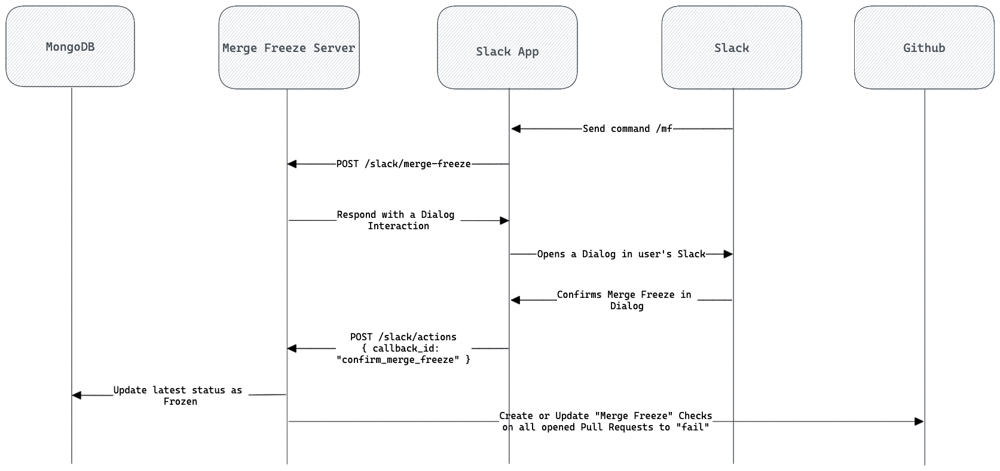
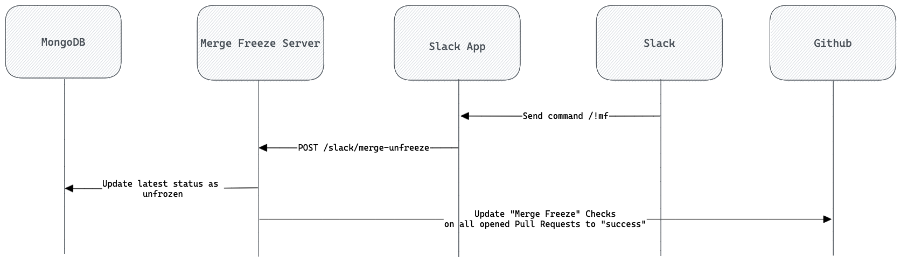
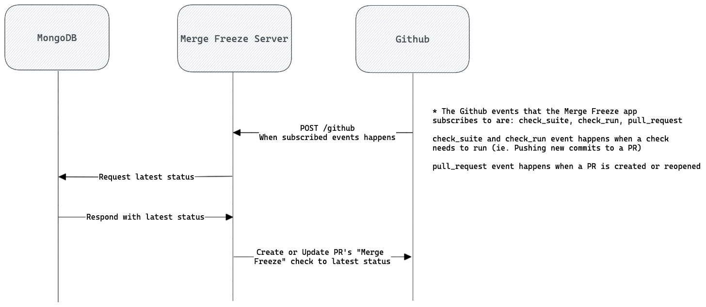

- [Description](#description)
  - [Merge Freeze flow diagram](#merge-freeze-flow-diagram)
  - [Merge Unfreeze flow diagram](#merge-unfreeze-flow-diagram)
  - [Github events flow diagram](#github-events-flow-diagram)
  - [Apps](#apps)
    - [Production](#production)
    - [Development](#development)
  - [Project Variables](#project-variables)
- [Set up Github App](#set-up-github-app)
- [Set up Slack App](#set-up-slack-app)
- [How to run locally](#how-to-run-locally)
  - [1. Setup environment variables](#1-setup-environment-variables)
  - [2. Install `ngrok`](#2-install-ngrok)
  - [3. Start local server](#3-start-local-server)
  - [4. Tunnel local server to the public with `ngrok`](#4-tunnel-local-server-to-the-public-with-ngrok)
- [Testing](#testing)
- [How to deploy](#how-to-deploy)

# Description
This Project is the backend node server that handles merge freeze requests from Slack. The server is responsible for:
- Handling the callback from Github app installation
- Handling the callback from Slack app installation
- Handling requests from running Slack commands (ie. `/mf`)
- Handling interactive requests from Slack (ie. Submission from dialogs)
- Handling Github events

## Merge Freeze flow diagram


## Merge Unfreeze flow diagram


## Github events flow diagram
This flow handles the continuity of the Merge Freeze status in Github. This server subscribes to three events from Github (`check_suite`, `check_run` and  `pull_request`).

In Github, whenever a new commit is pushed to a branch, or a branch is rebased, it removes all current checks and triggers a re-runs all checks on the new commit (ie. `tests`, `type-check`, etc...). We need to capture this event (`check_suite` and `check_run`) and recreate the Merge Freeze check with the latest status.

The `pull_request` event is fired when a Pull Request is created or reopened. It is important for us to handle this when a PR is reopened and to apply the current Merge Freeze status onto the reopened PR. We need to do this because when we call a merge freeze, we only freeze currently **opened** pull requests and not closed ones.



## Apps

### Production
- Github App - https://github.com/apps/freeze-merge
- Slack App - https://api.slack.com/apps/ATEP701T3

### Development
- Github App - https://github.com/apps/merge-freeze-test
- Slack App - https://api.slack.com/apps/A04MMDAJ9PC

## Project Variables

| Variable              | Description                                                                       |
| --------------------- | --------------------------------------------------------------------------------- |
| SLACK_SIGNING_SECRET  | Slack App > Basic Information > App Credentials                                   |
| SLACK_CLIENT_ID       | Slack App > Basic Information > App Credentials                                   |
| SLACK_CLIENT_SECRET   | Slack App > Basic Information > App Credentials                                   |
| GITHUB_APP_IDENTIFIER | Github App > General > About > App ID                                             |
| GITHUB_CLIENT_ID      | Github App > General > About > Client ID                                          |
| GITHUB_CLIENT_SECRET  | Github App > General > Client Secret                                              |
| GITHUB_SIGNING_SECRET |                                                                                   |
| PRIVATE_KEY           | Github App > General > Private keys                                               |
| ALLOWED_CHANNELS      | Slack channel names that is allow to call Merge Freeze commands. Comma separated. |
| MONGO_DB_URL          |                                                                                   |

# Set up Github App

> All configuration below uses production settings. Switch values to local dev values where appropriate.

This is just a documentation of how the Github app needs to be set up. Github apps are created [here](https://github.com/organizations/procurify/settings/apps).

| Config                  | Value                                                                               |
| ----------------------- | ----------------------------------------------------------------------------------- |
| Callback URL            | https://mergefreeze.procurify.com/auth/github/callback                              |
| Setup URL               | https://mergefreeze.procurify.com/manage                                            |
| Webhook                 | https://mergefreeze.procurify.com/github                                            |
| Reposiitory permissions | Actions, Checks, Commit Statuses, Pull requests to all be set up **Read and write** |
| Subscribe to events     | Check run, Check suite, Pull request                                                |


# Set up Slack App

> All configuration below uses production settings. Switch values to local dev values where appropriate.
> 
This is just a documentation of how the Slack app needs to be set up. Below is the manifest to configure the app.

```json
{
    "display_information": {
        "name": "Freeze Merge"
    },
    "features": {
        "bot_user": {
            "display_name": "Merge Freeze",
            "always_online": true
        },
        "slash_commands": [
            {
                "command": "/mf",
                "url": "https://mergefreeze.procurify.com/slack/merge-freeze",
                "description": "Merge Freeze",
                "usage_hint": "reason?",
                "should_escape": false
            },
            {
                "command": "/!mf",
                "url": "https://mergefreeze.procurify.com/slack/merge-unfreeze",
                "description": "Unfreeze all PR",
                "should_escape": false
            },
            {
                "command": "/!mfpr",
                "url": "https://mergefreeze.procurify.com/slack/merge-unfreeze-pr",
                "description": "Unfreeze one PR",
                "usage_hint": "PR Number",
                "should_escape": false
            }
        ]
    },
    "oauth_config": {
        "redirect_urls": [
            "https://mergefreeze.procurify.com/auth/slack/callback"
        ],
        "scopes": {
            "bot": [
                "channels:read",
                "chat:write",
                "commands",
                "groups:read",
                "incoming-webhook",
                "users:read",
                "channels:join",
                "mpim:read"
            ]
        }
    },
    "settings": {
        "event_subscriptions": {
            "request_url": "http://34.217.23.255:3000/slack/events",
            "bot_events": [
                "member_joined_channel"
            ]
        },
        "interactivity": {
            "is_enabled": true,
            "request_url": "https://mergefreeze.procurify.com/slack/actions"
        },
        "org_deploy_enabled": false,
        "socket_mode_enabled": false,
        "token_rotation_enabled": false
    }
}
```

# How to run locally

## 1. Setup environment variables

Find all the enviroment variable values in 1Password inside the secured note "Merge Freeze Dev .env". Create a `.env` file at the root of the project and paste all the values into the `.env` file.

## 2. Install `ngrok`
Run `npx ngrok authtoken 89chdcqyGAdoGVCkgNdAD_58SkX2g1hkJjdFDWLkGUa`. This `authtoken` allows for custom domain when using ngrok.

## 3. Start local server
```sh
yarn
yarn start
```

## 4. Tunnel local server to the public with `ngrok`
```
npx ngrok http -subdomain=freezemerge 3000
```

# Testing 
WIP
# How to deploy
All commits to the `master` branch will automatically deploy

